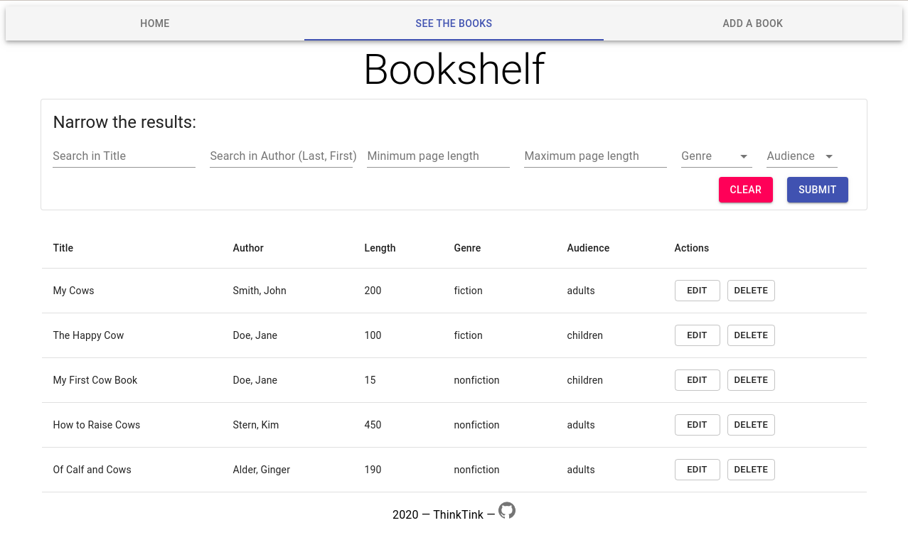

# Bovine Bookshelf

## Table of Contents
* [Overview](#overview)
* [Database Schema](#database-schema)
* [Data Integrity](#data-integrity)
* [Credits](#credits)

## Overview
This app is a virtual bookshelf that manages a collection of books around a given theme. The books can be displayed and filtered with different search terms. Books can also be added, edited, and deleted. The front end is built using React, Material-UI, and Axios, and the back end is built using Node with Express and MySQL2. [Click here](https://bovinebookshelf2.herokuapp.com) to view a read-only version live.

## Database Schema
This project uses a MySQL database with the following schema:

| Db Column | Data type | Description |
| :-- | :-- | :-- |
| id | integer | An auto-incremented primary key |
| title | text | The title of the book |
| author | text | The author, entered in Last, First format |
| length | integer | The length of the book in pages |
| genre | text | The genre of the book, either Fiction or Nonfiction |
| audience | text | The intended audience, either Adults or Children |

## Data Integrity
The following steps were taken to ensure data integrity:
* form validation on the front end
* escaped inputs for MySQL queries to prevent injection attacks
* the use of express-validator to validate and sanitize data on the back end

## Credits
Favicon from [Favicon.io](https://favicon.io/emoji-favicons/cow-face/). Homepage image by [Andy Kelly](https://unsplash.com/@askkell) on [Unsplash](https://unsplash.com/).
